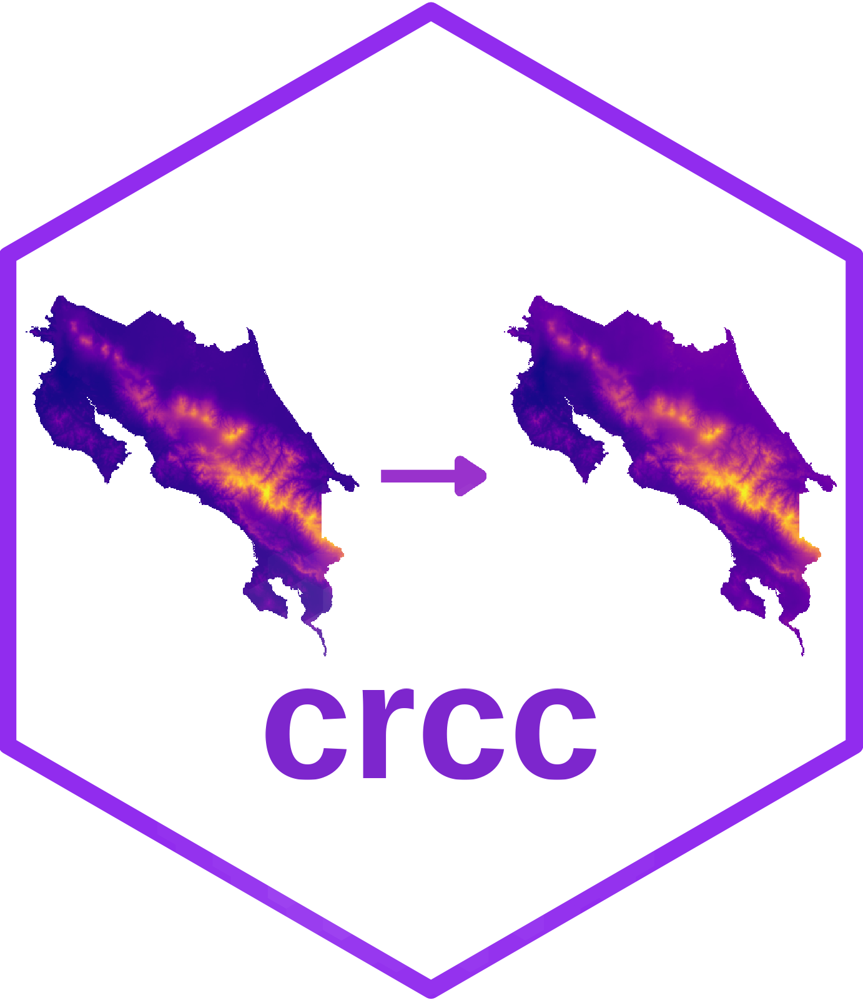

<!-- README.md is generated from README.Rmd. Please edit that file -->

```{r, include = FALSE}
knitr::opts_chunk$set(
  collapse = TRUE,
  comment = "#>",
  fig.path = "man/figures/README-",
  out.width = "100%"
)
```

# crcc 

<!-- badges: start -->
<!-- badges: end -->

The goal of crcc is to provides geospatial data of Costa Rica to do climate change analysis.

## Installation

You can install the development version of crcc from [GitHub](https://github.com/) with:

``` r
# install.packages("devtools")
devtools::install_github("ManuelSpinola/crcc")
```

## Example

This is a basic example which shows you how to use the package:

```{r example, message=FALSE, warning=FALSE}
## basic example code
library(crcc)
library(tidyverse)
library(sf)
library(stars)
```

```{r}
ggplot() +
  geom_stars(data = cr_inm_cm4_8_ssp126_2021_2040[,,,1]) +
  scale_fill_viridis_c(name = "Annual Mean Temperature", option = "C", na.value = "transparent", direction = -1) +
  theme_minimal() +
  coord_equal()
```


