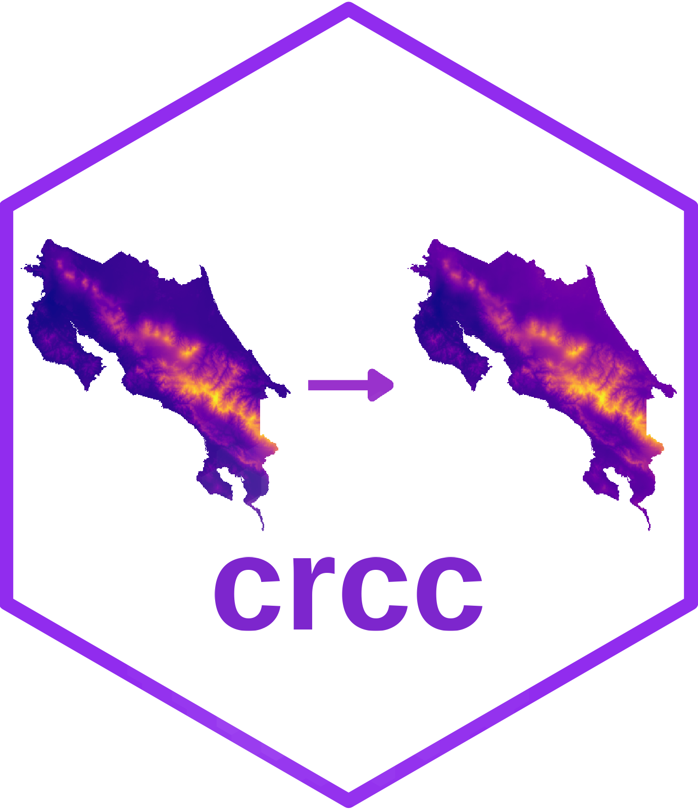
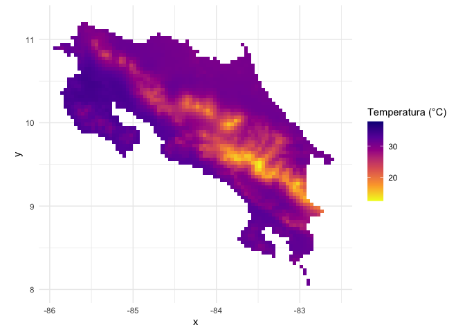

crcc: Costa Rica climate change
================

<!-- README.md is generated from README.Rmd. Please edit that file -->

# crcc 

<!-- badges: start -->
<!-- badges: end -->

The goal of crcc is to provides geospatial data of Costa Rica to do
climate change analysis.

## Installation

You can install the development version of crcc from
[GitHub](https://github.com/) with:

``` r
# install.packages("devtools")
devtools::install_github("ManuelSpinola/crcc")
```

## Example

This is a basic example which shows you how to use the package:

``` r
library(crcc)
library(crgeo)
library(tidyverse)
library(sf)
library(stars)
```

``` r
max_temp <- cr_future_worldclim(var = "tmax",
  res = 2.5,
  gcm = "ACCESS-CM2",
  ssp = "ssp126",
  interval = "2041-2060",
  path = tempdir(),
  return_stack = TRUE)
```

``` r
ggplot() +
  geom_stars(data = max_temp) +
  scale_fill_viridis_c(name = "Temperatura (°C)", na.value = "transparent", option = "C", direction = -1) +
  theme_minimal() +
  coord_equal()
```


